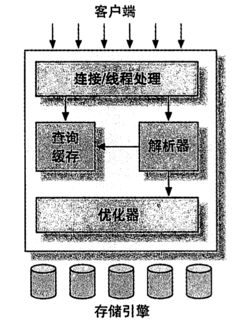

> # 1.第一章
> ## 1.1.MySQL服务器逻辑架构
> 
> - 最上层服务包含连接处理、授权认证、安全等
> - 第二层为MySQL核心服务，包含查询解析、分析、优化、缓存以及内置函数。
>   所有跨存储引擎的功能在这一层实现，存储过程、触发器、视图。
> - 第三层为存储引擎。存储引擎负责MySQL中数据的存储和提取。服务器通过API和存储引擎通信。
>   存储引擎包含几十个底层函数，用于执行"根据主键提取一行记录"，但存储引擎不会解析SQL。

> ### 1.1.1.连接管理和安全性

